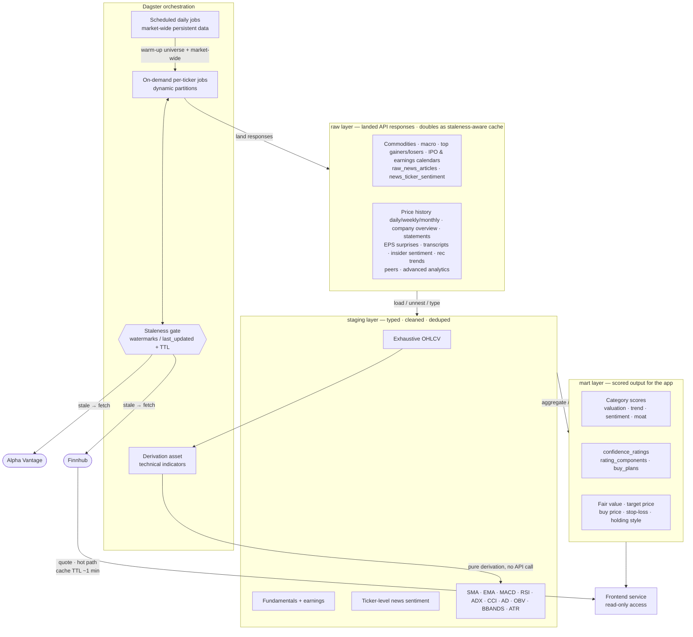

# Data Architecture
---
## Persistent Data
*Refreshed daily via scheduled Dagster jobs, independent of ticker activity.*

- **Commodities** — one table, key `(nominal, date)` — gold/silver spot prices
- **Macro indicators** — one table, key `(indicator, date)` — CPI, unemployment, fed funds, natural gas, inflation, real GDP (one row per indicator/date rather than a separate table per series)
- **Top Gainers/Losers** — own table, key `(ticker, date)`
- **IPO Calendar** — own table, key `(symbol, date)`
- **Earnings Calendar** — own table, key `(symbol, quarter, year)`
- **Market News (articles)** — `raw_news_articles`, key `article_id` (hash of URL) — title, summary, source, time_published, overall_sentiment_score
- **Market News (ticker links)** — `news_ticker_sentiment`, key `(article_id, ticker)` — relevance_score, ticker_sentiment_score. This junction table is what makes news joinable to a ticker for the Sentiment category, since one article can mention several tickers and one ticker appears in many articles.
---
## Real-Time / Ticker-Partitioned Data
*Fetched on-demand per ticker via dynamic partitions, gated by a staleness check against `last_updated`.*

- **Daily / Weekly / Monthly prices** — three separate tables, each key `(ticker, date)`. Different grains need independent staleness checks (daily checked every trading day; weekly/monthly far less often).
- **Company Overview** — own table, key `(ticker)` with `last_updated`, snapshot-style (latest row only). TTL: 1 week — but note this bundles slow-moving fields (sector, market cap) with faster-moving ones (50/200-day moving averages, analyst target price); worth revisiting whether the moving averages should instead be sourced from your own computed technicals rather than trusted from this snapshot.
- **Earnings Estimate** — own table, key `(ticker, quarter, year)` with `last_updated`. TTL: 1 week (could stretch to 30 days, updates only around earnings).
- **Income Statement** — own table, key `(ticker, fiscal_date_ending)` with `last_updated`. TTL: 30 days.
- **Balance Sheet** — own table, key `(ticker, fiscal_date_ending)` with `last_updated`. TTL: 30 days.
- **Cash Flow** — own table, key `(ticker, fiscal_date_ending)` with `last_updated`. TTL: 30 days.
- **EPS Surprises** — own table, key `(ticker, quarter, year)` with `last_updated`. TTL: 30 days.
- **Earnings Call Transcript** — own table, key `(ticker, quarter, year, speaker_sequence)` — one row per speaker segment, not one row per call. Effectively immutable once published — fetch once per quarter, never refetch.
- **Insider Sentiment** — own table, key `(ticker, year, month)` with `last_updated`. TTL: refetch only if current month has no row.
- **Technical Indicators** (SMA, EMA, STOCH, RSI, ADX, CCI, AD, OBV, BBANDS, ATR) — own table, key `(ticker, date)`, computed from `raw_prices_daily` via a downstream Dagster asset. No API call involved — this is pure derivation, refreshed whenever new daily bars land, not on the API-staleness clock.
- **Recommendation Trends** — own table, key `(ticker, period)` with `last_updated`. TTL: similar to fundamentals, low update frequency.
- **Peers** — own table, key `(ticker)` with `last_updated`. TTL: long (monthly or manual refresh) — peer groups rarely change.
- **Advanced Analytics** — own table(s), fixed 3-year window. Scalar stats (MIN, MAX, MEAN, VARIANCE, STDDEV, MAX_DRAWDOWN) can share one row per `(ticker, as_of_date)`; HISTOGRAM and CORRELATION/COVARIANCE matrices need their own tables since they're not scalar — correlation in particular is `(ticker_a, ticker_b, value)`, not one row per ticker.
---
## Data Flow Diagram

