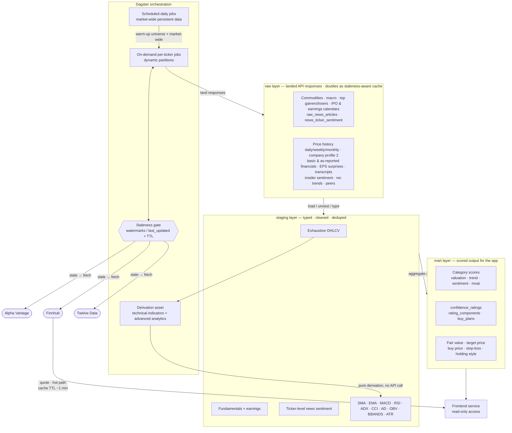

# Data Architecture
---
## Persistent Data
*Refreshed daily via scheduled Dagster jobs, independent of ticker activity.*

- **Commodities** — one table, key `(nominal, date)` — gold/silver spot prices (monthly)
- **Macro indicators** — one table, key `(indicator, date)` — CPI, unemployment, fed funds, natural gas, inflation, real GDP (one row per indicator/date rather than a separate table per series) (monthly)
- **Top Gainers/Losers** — own table, key `(ticker, date)` (weekdays)
- **IPO Calendar** — own table, key `(symbol, date)` (daily)
- **Earnings Calendar** — own table, key `(symbol, quarter, year)` (daily)
- **Market News (articles)** — `raw_news_articles`, key `article_id` (hash of URL) — title, summary, source, time_published, overall_sentiment_score (Daily)
- **Market News (ticker links)** — `news_ticker_sentiment`, key `(article_id, ticker)` — relevance_score, ticker_sentiment_score. This junction table is what makes news joinable to a ticker for the Sentiment category, since one article can mention several tickers and one ticker appears in many articles.
---
## Real-Time / Ticker-Partitioned Data
*Fetched on-demand per ticker via dynamic partitions, gated by a staleness check against `last_updated`.*

- **Prices (Daily)** — one table, key `(ticker, date)`. Sourced from **Twelve Data** `time_series` (`interval=1day`, `adjust=splits`) — split-adjusted to keep historical closes comparable across split events (e.g. a 4-for-1 split shouldn't make older closes look artificially high relative to current price). Weekly/monthly are derived downstream via resampling, not fetched separately.
- **Quote** — own table or cache, key `(ticker)`. Finnhub quote, hot path with cache TTL ~1 min.
- **Company Profile 2** — own table, key `(ticker)` with `last_updated`, snapshot-style (latest row only). TTL: 3 days.
- **Basic Financials** — own table, key `(ticker, quarter, year)` with `last_updated`. TTL: 3 days.
- **Financials As Reported** — own table, key `(ticker, quarter, year)` with `last_updated`. Staleness check compares against the filing's actual `filedDate`/period rather than a blind day-count TTL — refetch only if a newer filing (`accessNumber`) exists for that ticker, not on a fixed 7-day clock. Staging layer applies field-name normalization (Finnhub's raw XBRL tags → canonical schema, e.g. `Assets` → `totalAssets`) with fallback/coalesce logic per canonical metric, since tag names aren't standardized across companies.
- **EPS Surprises** — own table, key `(ticker, quarter, year)` with `last_updated`. TTL: 30 days.
- **Earnings Call Transcript** — own table, key `(ticker, quarter, year, speaker_sequence)` — one row per speaker segment, not one row per call. Effectively immutable once published — fetch once per quarter, never refetch.
- **Insider Sentiment** — own table, key `(ticker, year, month)` with `last_updated`. TTL: refetch only if current month has no row.
- **Recommendation Trends** — own table, key `(ticker, period)` with `last_updated`. TTL: 30 days.
- **Peers** — own table, key `(ticker)` with `last_updated`. TTL: 60 days.
- **Technical Indicators** (SMA, EMA, STOCH, RSI, ADX, CCI, AD, OBV, BBANDS, ATR) — own table, key `(ticker, date)`, computed from `raw_prices_daily` via a downstream Dagster asset. No API call involved — this is pure derivation, refreshed whenever new daily bars land, not on the API-staleness clock.
- **Advanced Analytics** — Scalar stats (MIN, MAX, MEAN, VARIANCE, STDDEV, MAX_DRAWDOWN), own table, key `(ticker, date)`, computed from `raw_prices_daily` via a downstream Dagster asset. No API call involved — this is pure derivation, refreshed whenever new daily bars land, not on the API-staleness clock.
---
### API Calling
`Push Advanced Analytics and Technical Indicators to be pipelined derivations rather than API calls.`

Monthly: Commodities (AV), Macro indicators (AV), Stock Symbol (FH)
Weekly: n/a
Weekdays: IPO Calendar (FH), Earnings Calendar (FH), Top Gainers/Losers (AV), Market News (AV)

On Stock Lookup (Everytime): Quote (FH), Time Series (TD)
On Stock Lookup (If stale): Company Profile 2 (FH), Basic Financials (FH), Financials As Reported (FH), Insider Sentiment (FH), Recommendation Trends (FH), EPS Surprises (FH), Peers (FH), Earnings Call Transcript (AV)

---
## Data Flow Diagram

