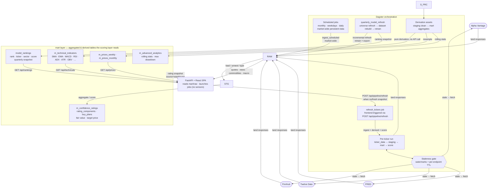

# Data Architecture
---
## Persistent Data
*Refreshed daily via scheduled Dagster jobs, independent of ticker activity.*

- **Commodities** — one table, key `(nominal, date)` — gold/silver spot prices (monthly)
- **Market indexes** — `raw_fred_market`, key `(series, date)` — CBOE VIX (`VIXCLS`, full history) and S&P 500 price index (`SP500`, ~10y daily per S&P licensing), landed daily from FRED; typed in `stg_fred_market`, aggregated into `m_fred_market` (levels + close-to-close momentum over 5/21/63/126/252d). Serves the ML model datasets as point-in-time market-regime features (daily)
- **Macro indicators** — one table, key `(indicator, date)` — CPI, unemployment, fed funds, natural gas, inflation, real GDP (one row per indicator/date rather than a separate table per series) (monthly)
- **Top Gainers/Losers** — own table, key `(ticker, date)` (weekdays)
- **IPO Calendar** — own table, key `(symbol, date)` (weekdays)
- **Earnings Calendar** — own table, key `(symbol, quarter, year)` (weekdays)
- **Market News (articles)** — `raw_news_articles`, key `article_id` (hash of URL) — title, summary, source, time_published, overall_sentiment_score (pulled 7am + 7pm ET plus the overnight daily run; served via SQL `WHERE` + `LIMIT/OFFSET` with ticker/date filters so paging never loads the full table)
- **Market News (ticker links)** — `news_ticker_sentiment`, key `(article_id, ticker)` — relevance_score, ticker_sentiment_score. This junction table is what makes news joinable to a ticker, since one article can mention several tickers and one ticker appears in many articles.
---
## Real-Time / Ticker-Partitioned Data
*Fetched on-demand per ticker via dynamic partitions, gated by a staleness check against `last_updated`.*

- **Prices (Daily)** — one table, key `(ticker, date)`. Sourced from **Twelve Data** `time_series` (`interval=1day`, `adjust=splits`) — split-adjusted to keep historical closes comparable across split events (e.g. a 4-for-1 split shouldn't make older closes look artificially high relative to current price). Weekly/monthly are derived downstream via resampling, not fetched separately.
- **Quote** — own table or cache, key `(ticker)`. Finnhub quote, hot path with cache TTL ~1 min.
- **Company Profile 2** — own table, key `(ticker)` with `last_updated`, snapshot-style (latest row only). TTL: 3 days.
- **Basic Financials** — own table, key `(ticker, quarter, year)` with `last_updated`. TTL: 3 days.
- **Financials As Reported** — own table, key `(ticker, quarter, year)` with `last_updated`. Staleness check compares the latest held `(year, quarter)` against the latest expected period from filing-deadline math — refetch only if a newer period should exist for that ticker, not on a fixed 7-day clock. XBRL tag normalization (Finnhub's raw XBRL tags → canonical metric names, e.g. `Assets` → `totalAssets`, via alias/prefix matching) happens in the mart scoring layer with fallback/coalesce logic per canonical metric, since tag names aren't standardized across companies.
- **EPS Surprises** — own table, key `(ticker, quarter, year)` with `last_updated`. TTL: 30 days.
- **Earnings Call Transcript** — own table, key `(ticker, quarter, year, speaker_sequence)` — one row per speaker segment, not one row per call. Effectively immutable once published — fetch once per quarter, never refetch.
- **Insider Sentiment** — own table, key `(ticker, year, month)` with `last_updated`. TTL: refetch only if current month has no row.
- **Recommendation Trends** — own table, key `(ticker, period)` with `last_updated`. TTL: 30 days.
- **Peers** — own table, key `(ticker)` with `last_updated`. TTL: 60 days.
- **Technical Indicators** (SMA, EMA, MACD, RSI, STOCH, ADX, CCI, AD, OBV, BBANDS, ATR) — table `m_technical_indicators`, key `(ticker, date)`, computed from the cleaned daily bars via a downstream Dagster asset. No API call involved — this is pure derivation, refreshed whenever new daily bars land, not on the API-staleness clock. Aggregations live in the mart layer, not staging.
- **Advanced Analytics** — Scalar stats (MIN, MAX, MEAN, VARIANCE, STDDEV, MAX_DRAWDOWN), table `m_advanced_analytics`, key `(ticker, date)`, computed from the cleaned daily bars via a downstream Dagster asset. No API call involved — this is pure derivation, refreshed whenever new daily bars land, not on the API-staleness clock.
---
### API Calling
`Push Advanced Analytics and Technical Indicators to be pipelined derivations rather than API calls.`

Monthly: Commodities (AV), Macro indicators (AV), Stock Symbol (FH)
Weekly: n/a
Weekdays: IPO Calendar (FH), Earnings Calendar (FH), Top Gainers/Losers (AV)
Daily: Market News (AV), Market Indexes (FRED)

On Stock Lookup (Everytime): Quote (FH), Time Series (TD)
On Stock Lookup (If stale): Company Profile 2 (FH), Basic Financials (FH), Financials As Reported (FH), Insider Sentiment (FH), Recommendation Trends (FH), EPS Surprises (FH), Peers (FH), Earnings Call Transcript (AV)

---
## Data Flow Diagram

> Notes on the loop:
> - The unprefixed mart objects the UI reads (`confidence_ratings`,
>   `category_scores`, `buy_plans`, `rating_components`) are **presentation
>   views** over the `m_*` snapshot tables — they rename storage columns to
>   the read contract (`computed_at → as_of`, `rating → UPPER_SNAKE advice`,
>   `stop_loss → stop_loss_price`) and join the company profile for name/logo.
>   `mart.model_weights` is seeded from the scoring module's weight spec at
>   schema init, so displayed weights can't drift from applied weights.
> - The quote path is **not** a direct frontend→Finnhub call — the UI reads
>   `raw.raw_quotes` from the warehouse; a refresh run updates it (TTL ~1 min)
>   whenever the ticker is recomputed.
> - Snapshot freshness: a search for a ticker with an existing rating serves
>   the mart snapshot immediately when fresh (younger than 1 day). A stale
>   snapshot is still served (source="refreshing" in the UI) while a refresh
>   job is launched; a ticker with no snapshot launches a job and reports
>   source="pending" until the mart snapshot lands.
> - Push model, no sensors: compute requests launch the `refresh_tickers` job
>   directly over GraphQL (`POST /api/pipeline/refresh`, per-ticker cooldown
>   dedups the UI's poll loop). The legacy `control.ticker_requests` queue
>   tables still exist but nothing consumes them.
> - Scheduled jobs and on-demand runs are independent: schedules warm the
>   persistent universe (news, calendars, movers, macro); on-demand runs
>   compute per-ticker ratings. The quarterly `quarterly_model_refresh` job
>   additionally refreshes the whole universe, rebuilds the training dataset,
>   retrains the ranking model, and exports `mart.model_rankings`.
>
> **Serving & UI.** The service layer (`stockidence.service`) is plain Python
> over DuckDB; FastAPI (`src/stockidence/api/`) wraps it as a mostly-read
> REST surface (one write path: rating lookups launch refresh jobs).
> The React SPA (`frontend-react/`) consumes that API with TanStack Query,
> polling every 10s while a rating is pending/refreshing. Pages: Model
> (ranking table from `mart.model_rankings`), Discover (movers, macro,
> news, calendars), Portfolio (local holdings + P&L), Docs.